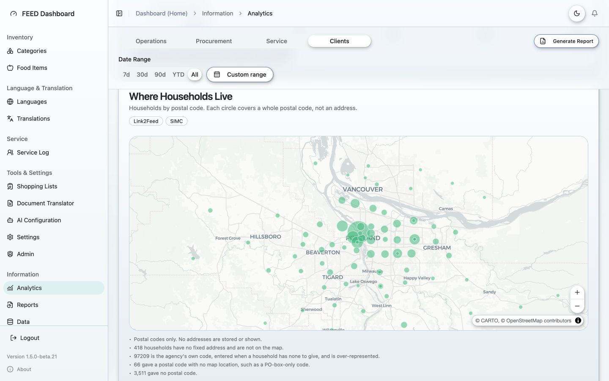
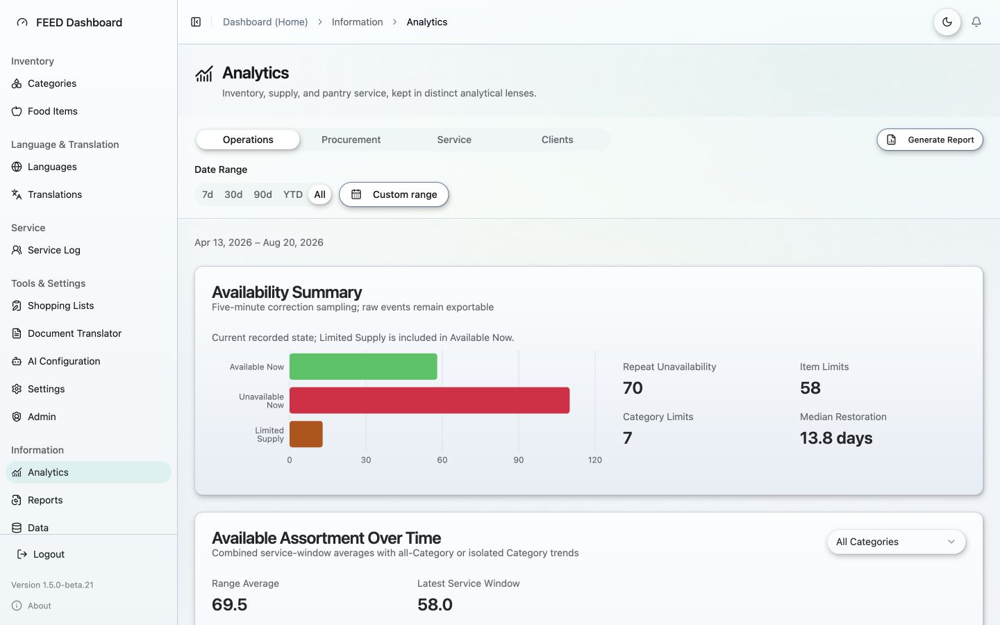
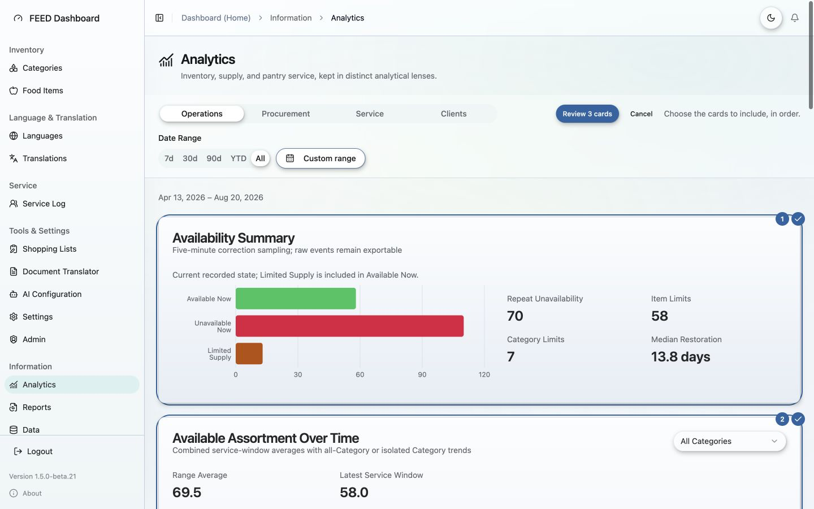
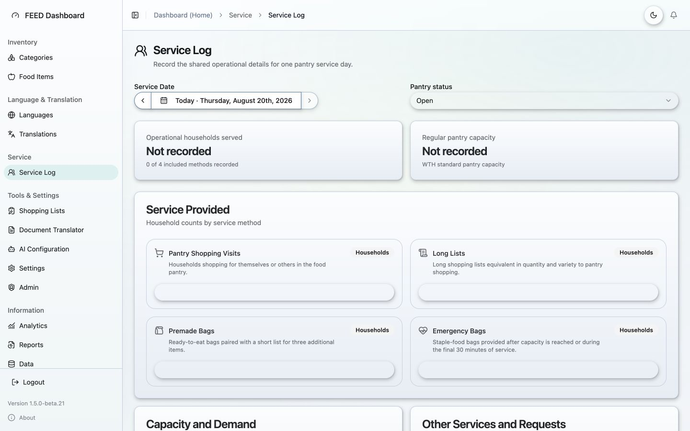

<p align="center">
  <a href="https://templepdx.com">
    <picture>
      <source media="(prefers-color-scheme: dark)" srcset="docs/temple-logo-dark.svg">
      
    </picture>
  </a>
</p>

<p align="center"><em>A creation of <a href="https://templepdx.com">Temple Consulting, LLC.</a></em></p>

# FEED — Food Equity & Efficient Delivery

A web-based food pantry management system built for
[William Temple House](https://www.williamtemple.org/) and shared as an
open-source reference implementation for other nonprofits running
food-distribution programs at scale.

**Production deployment:** https://feed.williamtemple.app
**License:** [AGPL-3.0-or-later](./LICENSE)
**Status:** v1.5.0 — released 2026-08-20

---

## What FEED does

FEED was built to support food pantry needs and take inventory management
beyond simple spreadsheets, without the costs of enterprise inventory
software. FEED supports the common operational reality of food pantries:

- **Inventory management** — categories, food items, per-item and
  per-category limits, in-stock / out-of-stock / clearance status.
- **Shopping list builder** — an interactive canvas-based template
  editor that produces printable, multi-page, multi-language shopping
  lists. Social Services staff design templates once; the system generates
  current-inventory-aware PDFs on demand.
- **AI-powered document translation** — staff can upload English forms
  and announcements (DOCX) and get back native-quality translations in
  any of 59 supported languages, with a managed cache so the same
  content isn't re-translated and re-billed. Backed by configurable
  AI providers (Anthropic, OpenAI, Google) with per-configuration
  cost limits.
- **Multi-language client materials** — Arabic, Persian, Hebrew, CJK,
  and other non-Latin scripts render correctly in both the in-browser
  preview and the exported PDFs (right-to-left bidi, font fallback,
  Arabic-script shaping all work as expected).
- **Dashboards** — translation throughput, cost projections, token
  usage by provider, response-time monitoring; all with proper
  empty-state handling for fresh installs.
- **Analytics in four lenses** — *Operations* (inventory history and
  availability), *Procurement* (Oregon Food Bank supply and spend), *Service*
  (what happened on a service day: households served, how service was
  delivered, household size, turned away, languages), and *Clients* (who the
  people are: age ranges, ethnicity, gender identity, housing, and a map of the
  postal codes households gave).
- **Reports you can hand to someone** — select any cards from any lens and get
  a PDF to read plus a CSV of the figures behind it. Save the selection as a
  template and re-run it later against a new date range, so a monthly funder
  report is set up once. Charts render server-side, including the postal-code
  map, so a saved report reproduces without a browser.
- **Honest counting** — cards draw on records that begin years apart and are
  never summed. Each says which record produced its figure, how far back that
  record reaches, and how many households were actually asked a question, so a
  low answer rate reads as a newer question rather than a refusal.
- **Pantry service operations** — a shared daily Service Log with
  administrator-configurable metrics, plus client visit imports from Link2Feed
  and SIMC. Large imports run as background jobs with live progress. FEED reads
  only what it needs and never stores names, addresses, phone numbers, or email
  addresses.
- **Unified data management** — one source-detecting Add Data workflow, durable
  cross-domain import history, and backup, restore, and reset. A restore can
  bring back selected units only, so recovering last month's inventory need not
  disturb anything else.
- **Administration** — see who has access, invite staff, revoke access with
  immediate effect, and optionally restrict sign-in to an allowlist. An audit
  history records what administrators changed.
- **In-app Help** — searchable staff guides written in plain language,
  plus a concise About page with project and license information.
- **Magic-link OTP authentication** — no passwords. Email-based
  sign-in via [Resend](https://resend.com/).

## Who FEED is for

- Food pantries and food banks running distribution operations they
  want to digitize without an expensive software contract.
- Nonprofits building multilingual client materials and looking for
  a translation pipeline that performs better than Google Translate.
- Developers who want a non-trivial reference for a React + Express +
  Prisma + SQLite app that includes a real PDF generation pipeline,
  and LLM integration.

If you fall into any of those buckets and FEED looks useful, you can
fork it, modify it, and deploy your own instance — see
[LICENSE](./LICENSE) for the terms.

---

## Screenshots

**Where Households Live** — households by postal code, sized by count. Circles
mark postal codes, never addresses; FEED stores no client location beyond the
code itself:



**Analytics, in four lenses** — Operations, Procurement, Service and Clients,
each scoped by the same date range:



**Build a report from any cards** — select what you want, in order, and export
a PDF plus a CSV of the underlying figures:



**Service Log** — a shared daily record with administrator-configurable
metrics:



**Dashboard** — inventory distribution, translation throughput, and cost
monitoring, with full light/dark theming:

| Dark | Light |
|------|-------|
|  |  |

**Shopping List Builder** — design a printable template once; the system
generates current-inventory-aware PDFs on demand:


**Food Item Management** — inventory with per-item limits, stock status,
and dietary flags:


**Document Translator** — upload English DOCX files and manage
translations across 59 languages:


---

## Quickstart (development)

### Prerequisites

- **Node.js 20 or 24** (Node 23 has known `fontkit` issues with PDF
  rendering)
- **Docker Desktop** (for the full local stack)
- A modern terminal

### Get it running

```bash
git clone https://github.com/MattGeiger/williamtemple-feed.git
cd williamtemple-feed
docker compose -f docker-compose.yml -f docker-compose.local.yml up -d --build
```

That starts the backend on `http://localhost:3001` and the frontend
on `http://localhost:5173`. Open the frontend URL in a browser to
sign in.

For an even faster inner-loop dev experience (without Docker), see the
"Development environment" section in
[CONTRIBUTING.md](./CONTRIBUTING.md).

### First-run setup

On a fresh database, you'll need to:

1. Sign in via the magic-link OTP flow (use any email you control)
2. Configure at least one AI provider in **Tools → AI Configuration**
   (Anthropic, OpenAI, or Google)
3. Enable languages you care about in **Languages**
4. Start adding categories, food items, and templates

The seed scripts in `packages/backend/scripts/` populate the default
language list and a starter set of system prompts. Run
`npm run seed` in `packages/backend` if you want them.

---

## Production deployment

FEED is deployed in production on a Raspberry Pi 5 via Docker, fronted
by Cloudflare Tunnel. The complete deployment guide is at
[`docs/deployment/DOCKER_DEPLOYMENT.md`](./docs/deployment/DOCKER_DEPLOYMENT.md).

Other deployment-related references:

- [`docs/deployment/raspberry-pi-cloudflare-tunnel.md`](./docs/deployment/raspberry-pi-cloudflare-tunnel.md) —
  the specific Pi + Cloudflare setup we use
- [`docs/deployment/deployment-checklist.md`](./docs/deployment/deployment-checklist.md) —
  pre-deploy verification
- [`docs/deployment/troubleshooting.md`](./docs/deployment/troubleshooting.md) —
  known issues and fixes

The Docker images are published from this repo. The stack is portable
to any Docker host (Synology, NAS, cloud VPS, your own home server).

---

## Tech stack

- **Frontend:** React 18, TypeScript, Vite, Tailwind CSS,
  Shadcn/Radix UI components, Motion (formerly Framer Motion) for the
  animated icon system
- **Backend:** Node.js, Express, TypeScript, Prisma ORM
- **Database:** SQLite (file-backed; switchable to Postgres via
  Prisma adapter)
- **PDF generation:** Chromium / HTML-to-PDF via Puppeteer; pdfmake
  retained as a reference path. Analytics charts — including the
  postal-code map — are generated server-side as SVG, so a saved report
  reproduces without a browser and without a network call
- **Mapping:** MapLibre GL in the browser; server-side maps use US Census
  cartographic boundaries (public domain) and GeoNames place names (CC BY),
  both read from disk
- **AI providers:** Anthropic (Claude family), OpenAI (GPT family),
  Google (Gemini family) — selectable per use case via in-app config
- **Email:** Resend for the magic-link OTP flow
- **Deployment:** Docker, Cloudflare Tunnel, multi-arch images
  (amd64 + arm64)

---

## Project structure

```
packages/
  backend/         Node + Express + Prisma + SQLite API server
    prisma/        Schema + migrations + seed scripts
    src/
      routes/      Express route handlers (one file per feature area)
      services/    Business logic (AI providers, translation pipeline,
                   shopping list builder, etc.)
  frontend/        Vite + React app
    src/
      components/  Feature components and shared UI primitives
      services/    Frontend API + error/message service layer
      hooks/       Custom hooks (dialog state, message system, etc.)
      contexts/    React context providers (theme, categories, etc.)

docs/              Per-section documentation, deployment guides,
                   design-system reference
```

Project conventions, error-handling patterns, and deeper architecture
notes are in [`AGENTS.md`](./AGENTS.md) — required reading for
non-trivial contributions.

---

## Contributing

Bug reports, feature requests, and pull requests are all welcome. See
[CONTRIBUTING.md](./CONTRIBUTING.md) for setup details, branching
conventions, and PR expectations.

If you're not sure whether a contribution fits the project direction,
open a Discussion or a `question` issue before investing significant
work.

**Security issues** — please do **not** open a public issue. See
[SECURITY.md](./SECURITY.md) for the private disclosure process.

---

## License

**The application code is open source. The William Temple House
deployment is branded. The brand is not open source.**

The FEED application code is licensed under
[AGPL-3.0-or-later](./LICENSE). In plain English:

1. The application code is AGPL-3.0-or-later.
2. Anyone may **use, study, modify, redistribute, and self-host** the
   software under the AGPL terms — free of charge.
3. If someone modifies FEED and offers it to others over a network
   (**including as a hosted web service**), AGPLv3 requires them to
   offer the corresponding source code to those users. This network-use
   clause is what distinguishes AGPL from MIT or Apache 2.0, and it's
   why FEED uses it: improvements should flow back to the community of
   pantries and nonprofits who run their own instances.
4. The **William Temple House name, logo, visual identity, and other
   branding assets are *not* open source** and may not be reused without
   separate written permission. See [TRADEMARKS.md](./TRADEMARKS.md).
5. **Food pantries deploying FEED should replace the included branding**
   — name, logo, colors, and contact information — with their own before
   any public deployment.

---

## Acknowledgements

FEED is a creation of [Temple Consulting, LLC.](https://templepdx.com),
built by Matt Geiger to serve the clients of
[William Temple House](https://www.williamtemple.org/), a Portland-based
nonprofit that has served the Pacific Northwest community since 1965,
where it runs in production. The application code is Temple Consulting's
own work, released as open source so peer organizations can use and
improve it; the William Temple House branding it ships with belongs to
William Temple House (see [TRADEMARKS.md](./TRADEMARKS.md)).

FEED was built with [Claude](https://www.anthropic.com/claude), by
Anthropic — a collaboration between a human author and an AI agent. The
project began with Claude Sonnet 3.5 (the
[Model Context Protocol](https://modelcontextprotocol.io/) was a turning
point, giving the model direct access to the file system), and
significant portions were later built with
[Claude Code](https://www.anthropic.com/claude-code).

The animated icon system uses
[Lucide React](https://lucide.dev/) as its base icon set, with
context-driven motion variants from [animate-ui](https://animate-ui.com/)
and [Lucide Animated](https://lucide-animated.com/).

Translation infrastructure is built on top of the major AI providers
(Anthropic, OpenAI, Google) with their model APIs.

Geographic data behind the Clients map: postal-code centroids from
[us-zips](https://github.com/nickcatal/us-zips) (MIT), cartographic boundaries
from the US Census via [us-atlas](https://github.com/topojson/us-atlas) (public
domain), and place names from [GeoNames](https://www.geonames.org/) via
[all-the-cities](https://github.com/zeke/all-the-cities), used under
[CC BY 4.0](https://creativecommons.org/licenses/by/4.0/). FEED derives map
positions from postal codes alone and never stores a client address.

---

## Contact

- **General questions / discussion:** open a GitHub Discussion or
  `question` issue. For non-GitHub contact, email
  [technology@williamtemple.org](mailto:technology@williamtemple.org).
- **Bug reports:** open an issue with the `bug` template.
- **Security disclosures:** see [SECURITY.md](./SECURITY.md).
- **Project maintainer:** Matt Geiger, Temple Consulting, LLC. —
  [matt@templepdx.com](mailto:matt@templepdx.com) ·
  [templepdx.com](https://templepdx.com). FEED is developed and maintained
  by Temple Consulting, LLC.; the application code is not owned by William
  Temple House.
- **William Temple House (the originating deployment):**
  https://www.williamtemple.org/about/contact/
