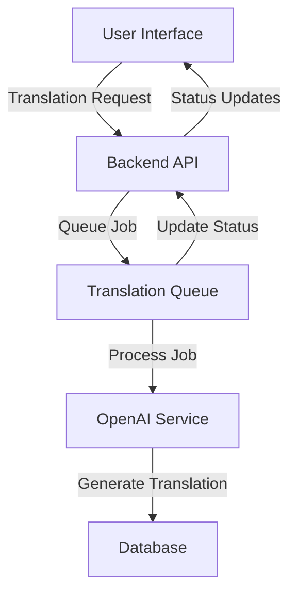

# Translation System

The FEED application includes a comprehensive multi-language translation system powered by OpenAI. This document explains how the translation system works and how to use it effectively.

## Overview

The translation system allows all content in the application to be translated into multiple languages automatically. It supports:

- Food item names and descriptions
- Category names
- Custom text content
- Document translation (DOCX files)

## Key Features

- Support for 59 languages
- Asynchronous translation processing
- Translation status tracking
- Retry capabilities for failed translations
- Cost monitoring and optimization
- Bulk translation operations
- Original English text inclusion option

## Architecture

The translation system consists of several components:

1. **Frontend**: User interface for requesting and managing translations
2. **Backend API**: Endpoints for translation requests and status updates
3. **Translation Queue**: Asynchronous processing of translation requests
4. **OpenAI Integration**: AI-powered translation generation
5. **Database**: Storage for translations and their metadata

## Translation Process

1. **Request**: A translation is requested (manually or automatically)
2. **Queuing**: The request is added to the translation queue
3. **Processing**: The queue processes requests based on priority and rate limits
4. **Translation**: OpenAI generates the translation
5. **Storage**: The translation is stored in the database
6. **Status Update**: The translation status is updated (pending → in_progress → completed/failed)

## Supported Languages

The system supports 59 languages, including:

- Spanish
- French
- German
- Chinese (Simplified and Traditional)
- Arabic
- Russian
- Japanese
- Korean
- And many more...

## Translation Types

### Food Item Translation

Food item names are automatically translated when:
- A new food item is created
- A food item's name is changed
- A new language is enabled

### Category Translation

Category names are automatically translated when:
- A new category is created
- A category's name is changed
- A new language is enabled

### Custom Text Translation

Custom text (such as shopping list titles or instructions) can be manually translated through the UI.

### Document Translation

DOCX documents can be uploaded and translated while preserving formatting:
- Paragraphs, headings, and lists are maintained
- Formatting (bold, italic, etc.) is preserved
- Tables and images remain intact

## Managing Translations

### Enabling Languages

1. Navigate to the Language Management section
2. Select "Enable Language" and choose a language
3. Confirm the action to start translating all content

### Translation Management Interface

The Translation Management interface allows:
- Viewing all translations with their status
- Filtering by language and translation type
- Manually editing translations
- Retrying failed translations
- Performing bulk operations

### Bulk Operations

The system supports bulk operations for:
- Translating multiple items at once
- Retrying multiple failed translations
- Editing multiple translations
- Adding or removing original English text to/from translations

### Original English Text Inclusion

The system provides functionality to include the original English text alongside translations:

- **Single Item**: Each translation can include the original English text in parentheses
- **Bulk Operation**: Apply this change to multiple translations at once
- **Toggle Functionality**: Add or remove original text via context-aware actions
- **Visual Indicators**: UI clearly shows when original text is included
- **Implementation**: Original text is added directly to translations with proper formatting
- **Use Cases**: Helpful for language learning, verification of translation accuracy, or when translations might be ambiguous

## Translation Status

Each translation has a status:

| Status | Description |
|--------|-------------|
| `pending` | Waiting to be processed |
| `in_progress` | Currently being translated |
| `completed` | Successfully translated |
| `failed` | Translation failed |
| `queued` | In the processing queue |

## Performance Metrics

The system tracks various metrics for monitoring:

- Token usage per translation
- Cost per translation
- Translation queue length
- Average processing time
- Success/failure rates

## Configuration

Translation system settings can be configured in:
- Backend: `/packages/backend/src/config/translation.ts`
- OpenAI model: Environment variable `OPENAI_MODEL`
- Rate limits: Environment variables for controlling API usage

## Best Practices

1. **Enable only needed languages**: Each enabled language adds translation overhead
2. **Use consistent naming**: Consistent naming patterns improve translation quality
3. **Review automatic translations**: Occasional review improves accuracy
4. **Monitor costs**: Keep track of translation costs, especially for large documents
5. **Batch translations**: Use bulk operations when possible to reduce overhead

## Troubleshooting

### Common Issues

1. **Failed Translations**
   - Check API key validity
   - Verify rate limits
   - Try individual retry
   
2. **Missing Translations**
   - Ensure language is enabled
   - Check for failed translation attempts
   - Verify item exists

3. **Slow Translations**
   - Large queue backlog
   - Rate limiting in effect
   - Large document bottlenecks