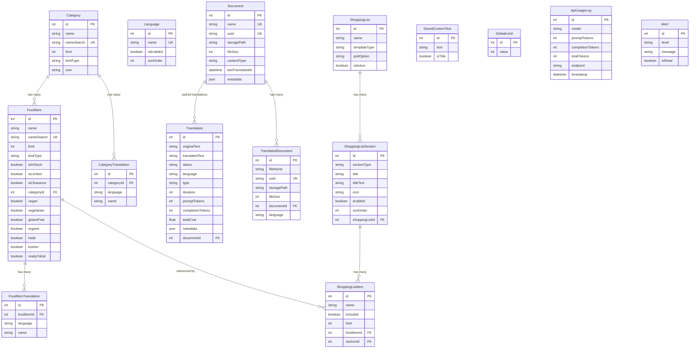

# Database Schema Documentation

This document provides a comprehensive overview of the FEED application's database schema, including model relationships, field descriptions, and validation rules.

## Models Overview

## Models

### GlobalLimit

A single record table that stores the global item limit for "No Limit" categories.

| Field | Type | Description | Constraints |
|-------|------|-------------|-------------|
| `id` | Integer | Primary key | Auto-increment |
| `value` | Integer | The global limit value | Default: 10 |
| `updatedAt` | DateTime | Last update timestamp | Auto-updated |

### Category

Food categories for organizing inventory.

| Field | Type | Description | Constraints |
|-------|------|-------------|-------------|
| `id` | Integer | Primary key | Auto-increment |
| `name` | String | Category name | Required, 3-36 chars |
| `nameSearch` | String | Lowercase name for searching | Unique |
| `limit` | Integer | Item limit per category | Default: 10, Range: 1-100 |
| `limitType` | String | Limit application scope | Default: "household", Options: "person" or "household" |
| `icon` | String | Category icon identifier | Default: "package" |
| `createdAt` | DateTime | Creation timestamp | Auto-generated |
| `updatedAt` | DateTime | Update timestamp | Auto-updated |

**Relationships:**
- Has many `FoodItem`
- Has many `CategoryTranslation`

### CategoryTranslation

Translations of category names in different languages.

| Field | Type | Description | Constraints |
|-------|------|-------------|-------------|
| `id` | Integer | Primary key | Auto-increment |
| `categoryId` | Integer | Foreign key to Category | Required, On delete: Cascade |
| `language` | String | Language name | Required |
| `name` | String | Translated category name | Required |
| `createdAt` | DateTime | Creation timestamp | Auto-generated |
| `updatedAt` | DateTime | Update timestamp | Auto-updated |

**Unique constraint:** `[categoryId, language]` pair must be unique

### FoodItem

Individual food items in the inventory.

| Field | Type | Description | Constraints |
|-------|------|-------------|-------------|
| `id` | Integer | Primary key | Auto-increment |
| `name` | String | Food item name | Required, 3-36 chars |
| `nameSearch` | String | Lowercase name for searching | Unique |
| `limit` | Integer | Item quantity limit | Default: 10, Range: 1-100 |
| `limitType` | String | Limit application scope | Default: "household", Options: "person" or "household" |
| `isInStock` | Boolean | Whether item is in stock | Default: true |
| `isLimited` | Boolean | Whether item is limited | Default: false |
| `isClearance` | Boolean | Whether item is on clearance | Default: false |
| `categoryId` | Integer | Foreign key to Category | Required |
| `vegan` | Boolean | Vegan dietary flag | Default: false |
| `vegetarian` | Boolean | Vegetarian dietary flag | Default: false |
| `glutenFree` | Boolean | Gluten-free dietary flag | Default: false |
| `organic` | Boolean | Organic dietary flag | Default: false |
| `halal` | Boolean | Halal dietary flag | Default: false |
| `kosher` | Boolean | Kosher dietary flag | Default: false |
| `readyToEat` | Boolean | Ready-to-eat flag | Default: false |
| `createdAt` | DateTime | Creation timestamp | Auto-generated |
| `updatedAt` | DateTime | Update timestamp | Auto-updated |

**Relationships:**
- Belongs to `Category`
- Has many `FoodItemTranslation`
- Referenced by many `ShoppingListItem`

### FoodItemTranslation

Translations of food item names in different languages.

| Field | Type | Description | Constraints |
|-------|------|-------------|-------------|
| `id` | Integer | Primary key | Auto-increment |
| `foodItemId` | Integer | Foreign key to FoodItem | Required, On delete: Cascade |
| `language` | String | Language name | Required |
| `name` | String | Translated food item name | Required |
| `createdAt` | DateTime | Creation timestamp | Auto-generated |
| `updatedAt` | DateTime | Update timestamp | Auto-updated |

**Unique constraint:** `[foodItemId, language]` pair must be unique

### Language

Supported languages for the application.

| Field | Type | Description | Constraints |
|-------|------|-------------|-------------|
| `id` | Integer | Primary key | Auto-increment |
| `name` | String | Language name | Required, Unique |
| `isEnabled` | Boolean | Whether language is active | Default: false |
| `sortOrder` | Integer | Display order in the UI | Required |
| `createdAt` | DateTime | Creation timestamp | Auto-generated |
| `updatedAt` | DateTime | Update timestamp | Auto-updated |

### Translation

General-purpose translation cache for various text content.

| Field | Type | Description | Constraints |
|-------|------|-------------|-------------|
| `id` | Integer | Primary key | Auto-increment |
| `originalText` | String | Text to be translated | Required |
| `translatedText` | String | Translated text | Optional |
| `status` | String | Translation status | Default: "pending", Options: "pending", "in_progress", "completed", "failed", "queued" |
| `language` | String | Target language name | Required |
| `type` | String | Content type | Required, Options: "FoodItem", "Category", "Custom", "Generated (Document)" |
| `duration` | Integer | Translation processing time (ms) | Optional |
| `promptTokens` | Integer | OpenAI prompt tokens used | Optional |
| `completionTokens` | Integer | OpenAI completion tokens used | Optional |
| `totalCost` | Float | Translation cost in USD | Optional |
| `metadata` | JSON | Additional information | Optional |
| `documentId` | Integer | Foreign key to Document | Optional, On delete: SetNull |
| `createdAt` | DateTime | Creation timestamp | Auto-generated |
| `updatedAt` | DateTime | Update timestamp | Auto-updated |

**Unique constraint:** `[originalText, language, type]` combination must be unique

**Relationships:**
- May belong to `Document` (for document translations)

### Document

Original document files uploaded for translation.

| Field | Type | Description | Constraints |
|-------|------|-------------|-------------|
| `id` | Integer | Primary key | Auto-increment |
| `name` | String | Document name | Required, Unique |
| `uuid` | String | Unique identifier | Unique, Auto-generated |
| `storagePath` | String | File system path | Optional |
| `fileSize` | Integer | File size in bytes | Optional |
| `contentType` | String | MIME type | Default: "application/vnd.openxmlformats-officedocument.wordprocessingml.document" |
| `lastTranslatedAt` | DateTime | Last translation timestamp | Optional |
| `metadata` | JSON | Additional information | Optional |
| `createdAt` | DateTime | Creation timestamp | Auto-generated |
| `updatedAt` | DateTime | Update timestamp | Auto-updated |

**Relationships:**
- Has many `TranslatedDocument`
- Has many `Translation` (cached translations)

### TranslatedDocument

Translated versions of uploaded documents.

| Field | Type | Description | Constraints |
|-------|------|-------------|-------------|
| `id` | Integer | Primary key | Auto-increment |
| `fileName` | String | File name | Required |
| `uuid` | String | Unique identifier | Unique, Auto-generated |
| `storagePath` | String | File system path | Required |
| `fileSize` | Integer | File size in bytes | Required |
| `documentId` | Integer | Foreign key to Document | Required |
| `language` | String | Target language name | Required |
| `createdAt` | DateTime | Creation timestamp | Auto-generated |
| `metadata` | JSON | Additional information | Optional |

**Relationships:**
- Belongs to `Document`

### ShoppingList

Shopping list templates for client distribution.

| Field | Type | Description | Constraints |
|-------|------|-------------|-------------|
| `id` | Integer | Primary key | Auto-increment |
| `name` | String | Template name | Required |
| `templateType` | String | Layout type | Default: "full-page", Options: "full-page", "split-page", "custom" |
| `gridOption` | String | Layout grid option | Optional |
| `isActive` | Boolean | Whether template is active | Default: true |
| `createdAt` | DateTime | Creation timestamp | Auto-generated |
| `updatedAt` | DateTime | Update timestamp | Auto-updated |

**Relationships:**
- Has many `ShoppingListSection`

### ShoppingListSection

Sections within a shopping list template.

| Field | Type | Description | Constraints |
|-------|------|-------------|-------------|
| `id` | Integer | Primary key | Auto-increment |
| `sectionType` | String | Section purpose | Required, Options: "client-info", "canned-goods", "title-text", "regular-text", etc. |
| `title` | String | Section title | Required |
| `titleText` | String | Optional title text content | Optional |
| `icon` | String | Section icon identifier | Optional |
| `enabled` | Boolean | Whether section is visible | Default: true |
| `sortOrder` | Integer | Display order | Required |
| `shoppingListId` | Integer | Foreign key to ShoppingList | Required, On delete: Cascade |

**Relationships:**
- Belongs to `ShoppingList`
- Has many `ShoppingListItem`

### ShoppingListItem

Individual items in a shopping list section.

| Field | Type | Description | Constraints |
|-------|------|-------------|-------------|
| `id` | Integer | Primary key | Auto-increment |
| `name` | String | Item name | Required |
| `included` | Boolean | Whether to include in list | Default: true |
| `limit` | Integer | Item quantity limit | Optional |
| `foodItemId` | Integer | Foreign key to FoodItem | Optional, On delete: SetNull |
| `sectionId` | Integer | Foreign key to ShoppingListSection | Required, On delete: Cascade |

**Relationships:**
- May belong to `FoodItem`
- Belongs to `ShoppingListSection`

### SavedCustomText

Reusable custom text blocks for shopping lists.

| Field | Type | Description | Constraints |
|-------|------|-------------|-------------|
| `id` | Integer | Primary key | Auto-increment |
| `text` | String | Text content | Required |
| `isTitle` | Boolean | Whether it's a title or regular text | Default: true |
| `createdAt` | DateTime | Creation timestamp | Auto-generated |
| `updatedAt` | DateTime | Update timestamp | Auto-updated |

### ApiUsageLog

Logging for API usage tracking and billing.

| Field | Type | Description | Constraints |
|-------|------|-------------|-------------|
| `id` | Integer | Primary key | Auto-increment |
| `model` | String | AI model used | Required |
| `promptTokens` | Integer | Input tokens used | Required |
| `completionTokens` | Integer | Output tokens used | Required |
| `totalTokens` | Integer | Total tokens consumed | Default: 0 |
| `endpoint` | String | API endpoint called | Default: "completion" |
| `timestamp` | DateTime | Usage timestamp | Auto-generated |

**Indexed fields:** `timestamp` (for performance)

### Alert

System alerts for important notifications.

| Field | Type | Description | Constraints |
|-------|------|-------------|-------------|
| `id` | Integer | Primary key | Auto-increment |
| `level` | String | Alert severity | Required, Options: "info", "warning", "error" |
| `message` | String | Alert message | Required |
| `isRead` | Boolean | Whether alert is acknowledged | Default: false |
| `createdAt` | DateTime | Creation timestamp | Auto-generated |