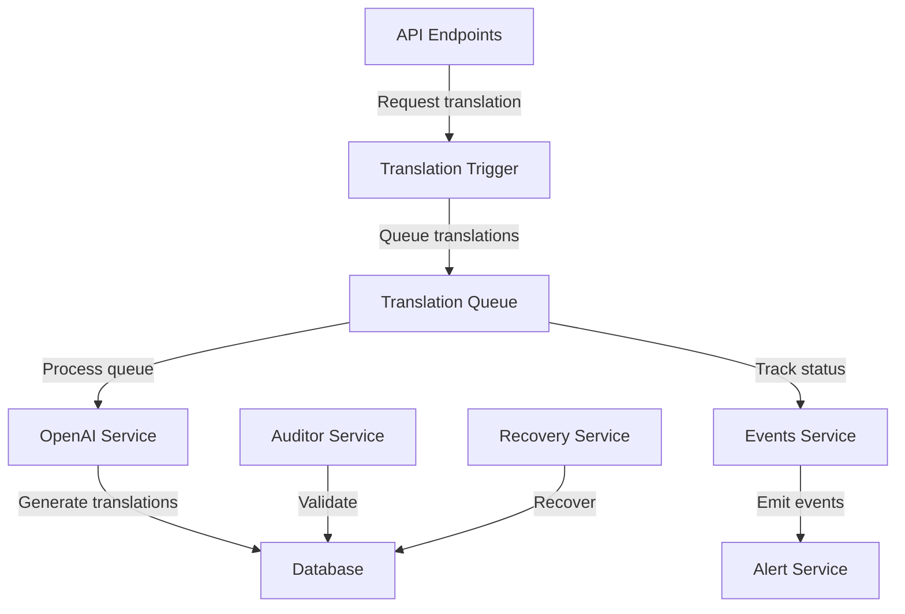

# Translation System Services

This document provides an overview of the translation system services in the FEED application.

## Service Architecture

The translation system is designed with separation of concerns and asynchronous processing to handle translations efficiently:



## Translation Queue Service

The Translation Queue Service manages the asynchronous processing of translations.

### Purpose

- Process translations asynchronously to avoid blocking API responses
- Handle rate limiting and retry logic
- Track translation status and metrics
- Ensure translations are processed in order

### Usage

```typescript
// Queue a single food item for translation
await translationQueueService.queueFoodItemTranslations(
  foodItemId,
  foodItemName
);

// Queue translations after name update
await translationQueueService.queueFoodItemUpdateTranslations(
  foodItemId,
  newName,
  oldName,
  keepTranslations
);

// Queue document translation
await translationQueueService.queueDocumentTranslation(
  documentId,
  language
);
```

### Key Methods

| Method | Description | Parameters |
|--------|-------------|------------|
| `queueFoodItemTranslations` | Queue translations for a new food item | `foodItemId`: number, `name`: string |
| `queueCategoryTranslations` | Queue translations for a new category | `categoryId`: number, `name`: string |
| `queueFoodItemUpdateTranslations` | Queue translations after a food item name change | `foodItemId`: number, `newName`: string, `oldName`: string, `keepTranslations`: boolean |
| `queueCategoryUpdateTranslations` | Queue translations after a category name change | `categoryId`: number, `newName`: string, `oldName`: string, `keepTranslations`: boolean |
| `queueDocumentTranslation` | Queue a document for translation | `documentId`: number, `language`: string |
| `processQueue` | Process the translation queue | None |

### Configuration

The queue service uses the following environment variables:

- `OPENAI_API_KEY`: API key for the OpenAI service
- `OPENAI_MODEL`: Model to use for translations (default: "gpt-4o-mini")

Rate limiting is configured via AI Configuration records in the database (tokensPerMinute, requestsPerMinute, requestsPerDay) rather than `.env` variables.

## OpenAI Service

The OpenAI Service handles direct interaction with the OpenAI API.

### Purpose

- Provide a consistent interface to the OpenAI API
- Handle authentication and error handling
- Track token usage and costs
- Format prompts for optimal translation results

### Usage

```typescript
// Translate text to a target language
const result = await openaiService.translate(
  originalText,
  targetLanguage
);

// Get token metrics for a text
const metrics = await openaiService.getTokenMetrics(
  text,
  targetLanguage
);
```

### Key Methods

| Method | Description | Parameters |
|--------|-------------|------------|
| `translate` | Translate text to a target language | `text`: string, `targetLanguage`: string, `options?`: object |
| `getTokenMetrics` | Calculate token usage metrics | `text`: string, `targetLanguage`: string |
| `logApiUsage` | Log API usage for tracking | `model`: string, `promptTokens`: number, `completionTokens`: number |

### Translation Prompt

The service uses a carefully crafted system prompt to guide the translation:

```
You are a professional translator with expertise in {{targetLanguage}}.
Translate the following English text into {{targetLanguage}}.
Keep special symbols, numbers, and formatting intact.
If a phrase should not be translated (like a proper name), leave it in English.
```

## Translation Auditor Service

The Translation Auditor Service validates and maintains translation consistency.

### Purpose

- Find missing translations
- Validate translation quality
- Maintain consistency across languages
- Generate reports on translation coverage

### Usage

```typescript
// Find missing translations for all enabled languages
const missing = await translationAuditor.findMissingTranslations();

// Find missing translations for a specific type
const missingFoodItems = await translationAuditor.findMissingFoodItemTranslations(
  'Spanish'
);
```

### Key Methods

| Method | Description | Parameters |
|--------|-------------|------------|
| `findMissingTranslations` | Find all missing translations | `options?`: object |
| `findMissingFoodItemTranslations` | Find missing food item translations | `language`: string |
| `findMissingCategoryTranslations` | Find missing category translations | `language`: string |
| `validateTranslation` | Validate a translation's format | `translation`: object |

## Translation Events Service

The Translation Events Service handles events related to translations.

### Purpose

- Emit events for translation status changes
- Track translation progress
- Provide hooks for UI notifications
- Enable real-time updates

### Usage

```typescript
// Listen for translation completion
translationEvents.on('translationComplete', (data) => {
  console.log(`Translation ${data.id} completed for ${data.language}`);
});

// Emit a translation event
translationEvents.emit('translationFailed', {
  id: 123,
  language: 'Spanish',
  error: 'Rate limit exceeded'
});
```

### Event Types

| Event | Description | Data |
|-------|-------------|------|
| `translationQueued` | Translation has been queued | `{ id, type, language }` |
| `translationStarted` | Translation processing has started | `{ id, type, language }` |
| `translationComplete` | Translation completed successfully | `{ id, type, language, duration, tokens }` |
| `translationFailed` | Translation failed | `{ id, type, language, error }` |
| `translationProgress` | Batch progress update | `{ completed, total, language }` |

## Document Translation Service

The Document Translation Service handles the translation of document files (.docx).

### Purpose

- Extract text from documents
- Maintain document formatting
- Generate translated documents
- Handle document storage

### Usage

```typescript
// Translate a document
await documentService.translateDocument(
  documentId,
  language
);

// Extract text from a document
const text = await docxService.extractText(filePath);

// Generate a translated document
await docxService.generateTranslatedDocument(
  originalDocPath,
  translations,
  outputPath
);
```

### Key Methods

| Method | Description | Parameters |
|--------|-------------|------------|
| `translateDocument` | Translate a document to a language | `documentId`: number, `language`: string |
| `extractText` | Extract text from a DOCX file | `filePath`: string |
| `generateTranslatedDocument` | Generate a translated DOCX | `originalPath`: string, `translations`: object, `outputPath`: string |
| `preserveFormatting` | Preserve formatting during translation | `text`: string, `translation`: string |

## Translation Recovery Service

The Translation Recovery Service handles recovery of failed translations.

### Purpose

- Retry failed translations
- Recover from API errors
- Handle partial transaction failures
- Provide data consistency

### Usage

```typescript
// Retry failed translations
await translationRecoveryService.retryFailedTranslations();

// Retry specific translation
await translationRecoveryService.retryTranslation(translationId);
```

### Key Methods

| Method | Description | Parameters |
|--------|-------------|------------|
| `retryFailedTranslations` | Retry all failed translations | `options?`: object |
| `retryTranslation` | Retry a specific translation | `translationId`: number |
| `recoverOrphanedTranslations` | Find and recover orphaned translations | None |

## Best Practices

1. **Error Handling**
   - Always use try-catch blocks when interacting with translation services
   - Handle API rate limits gracefully
   - Implement exponential backoff for retries

2. **Performance**
   - Use batch operations for multiple translations
   - Process translations asynchronously
   - Monitor token usage to optimize costs

3. **Testing**
   - Use mock responses for OpenAI API in tests
   - Test token calculation separately from API calls
   - Validate translations with automated tests
